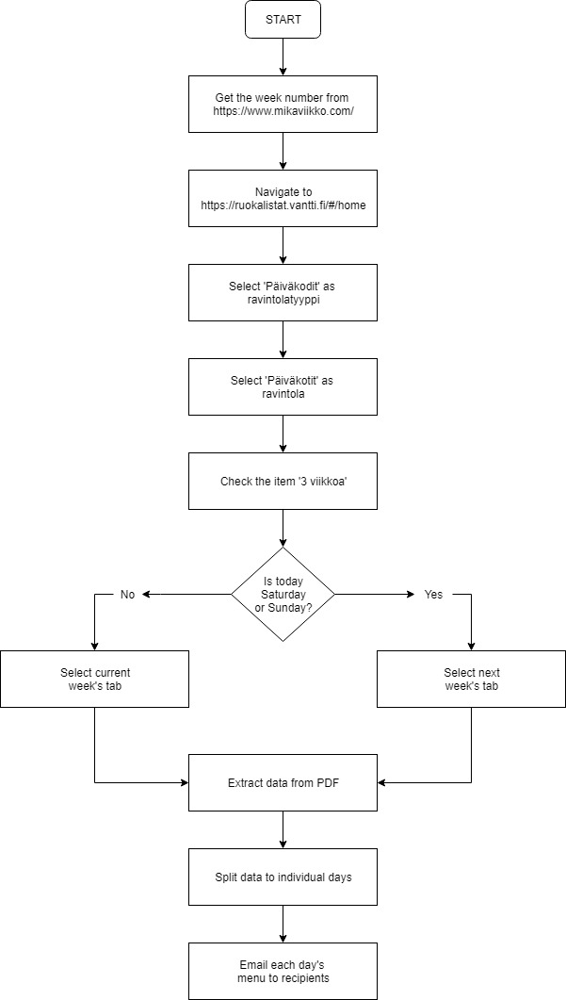

# Kindegarden menu service
An UiPath process to fetch the menu of a kindergarden from web, split the data by indivudual weekdays and to email them. This particular process only works with Vantti (food provider).

### Prerequisites:
* Install UiPath Studio
* Install Google Chrome
* Machine must be connected to Orchestrator to define assets (variables)

### Modifications to tools:
 * In order to make downloading of files work, Chrome's settings must be changed to ask download location. Settings -> Advanced -> Ask where to save each file before downloading -> On
 
 ### Process map
 
  
  
  
 
